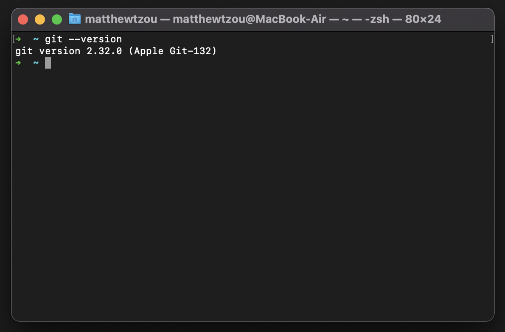

# acm-uga.github.io
The repo behind ACM at UGA's website. If you are a current UGA student and an ACM attendee, do not hesitate to fork a copy of this repo and make changes of your own!

# Table of Contents
1. [What is GitHub?](#example)
2. [Example2](#example2)
3. [Getting Started](#third-example)


## What is GitHub?
GitHub is a service for developing software using Git for version control. It allows you to manage code and keep track of changes made to a code repo. 
## Example2
## Getting Started
To make changes to this code, it is recommended that you fork the repo. A fork is a copy of the original repository that is unique to your account. Any changes you make to the fork will not be reflected in the main repo unless you merge the changes on your fork to the original repository (next section).
1. Ensure that you have Git installed on your device. Instructions on installing Git for your device (Linux, Mac, Windows) can be found [here](https://git-scm.com/book/en/v2/Getting-Started-Installing-Git). Git is installed if you are able to open a terminal (ex: Bash or ZSH) and see output similar to the following when you type:
```
git --version
```

2. To fork the repo, go to the main page for the repo at <https://github.com/acm-uga/acm-uga.github.io/tree/master>. Hit the fork


